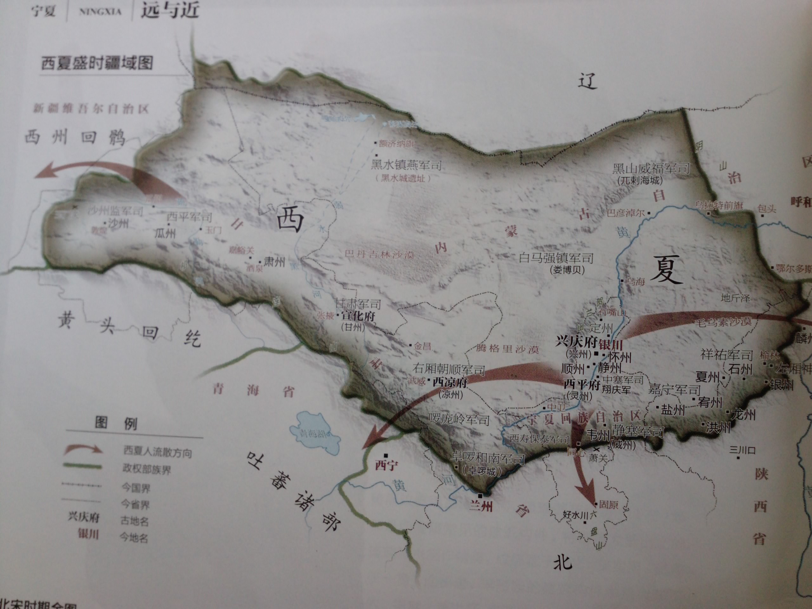

# 白日夢難成白首，痴情人錯付痴心

北宋紹聖二年 八月十五（中秋）

西夏國都'興慶府'位於銀川平原上，由於平原西北面為賀蘭山脈，阻擋了西伯利亞的冷空氣和'騰格里沙漠'的風沙。 又由於黃河的多次改道，做成平原上有多個湖泊，所以向有'塞北江南'之稱。 自秦代以來，先民又在黃河河道上做了多次水利工程，引河水灌溉，令這裡的物產豐富。 但出了平原東西兩面均是浩瀚的沙漠，只有南面的六盤山通往大宋國境。 六盤山便成了兩國經常交鋒的地方。

當時西夏大權全落在太皇太后梁氏之手。 梁氏本是漢人，但對宋國卻是恨之入骨，多次向宋國發動戰爭。 西夏皇帝李乾顺雖多次提出對宋遼兩國和好的策略，但全為梁氏所拒。 李乾顺轉而親近剛來的西夏駙馬、靈鷲峰縹緲宫主人，令梁氏大為不滿，種下了日後的禍根。

這日，章達孚正和鄔老大外出狩獵。 到了中午時分二人便坐下來休息，鄔老大笑道："程丫頭最近自創了一套掌法，天天嚷著要來向我討教。" 章達孚道："我給她煩死了，只有尊主才會和她認真。" 鄔老大嘆道："三十六洞、七十二島之中，願意跟隨尊主來西夏的，如今便只剩下咱們四洞八島。 我來了這裡，才體會到這裡的好處。" 章達孚道："像你有妻有兒的，當然說是好。" 鄔老大笑道："你何不也討個媳婦？" 章達孚道："我一介武夫，啥會看上啦？" 鄔老大笑道："我看阿燕便不錯。" 章達孚見鄔老大說中他的心事，不禁臉上一紅。 章達孚道："人家是大家閨秀，怎會看上我呢？不是白日做夢嗎？" 鄔老大道："也不盡然。 如今兵荒馬亂，說不定便肯了。 今天正好是中秋節，你何不借機去試探虛實？"

午後，章達孚便來到阿燕家。 王氏看見章達孚來了，便道："恩公，快來坐下！阿燕！快去倒茶給恩公！" 阿燕原本正坐在王氏旁邊做針線，聽了這話連忙起來讓座。 章達孚道："大娘客氣。" 章達孚對提親之事不知如何啟齒，坐了半天，正想辭行，王氏道："不知恩公到來是否還有別的事？" 王氏見他欲言又止，便道："恩公但說無妨。" 章達孚瞧了阿燕一眼，吞吞吐吐地對王氏道："我有一事要和大娘商量。" 此時見阿燕紅著臉道："娘，我先回內堂去了。" 章達孚見阿燕嬌羞之態，神為之盪。 王氏笑道："恩公是來提親的麼？" 章達孚見問便道："不知...大娘...意下如何？" 王氏笑道："我當然喜歡了！" 章達孚聽她如此說，如在夢中，還有點不敢相信，便道："雖說婚姻大事由父母作主，但如果阿燕不喜歡，我也不會強人所難。" 王氏笑道："這是哪裡的話？阿燕是我所生的，她的心意我怎會不知！" 章達孚此刻才喜上眉梢，直跳了起來，片刻才道："好、好、那太好了！咱們便定個吉日..."王氏笑道："一切聽從恩公作主好了。" 章達孚喜不自勝，道："我這便回去準備！"

翌日，章達孚的徒弟韓秋生氣沖沖地來到阿燕家裡，質問王氏道："你是不是答應了師父的親事？" 王氏反問道："不好麼？" 韓秋生急道："當然不好！阿燕怎可以嫁給師父！" 王氏像被五雷轟頂，驚問道："你說甚麼？" 原來王氏一直以為是章達孚替他的徒兒韓秋生來提親，此刻才知弄錯了。 此時阿燕也從內堂衝出來道："娘，我寧死也不會嫁給他！"

韓秋生和阿燕一起怪責王氏沒有把事情弄清楚便答應章達孚的婚事。 王氏哭著對韓秋生道："那天你說請恩公來替你向我們提親，第二天他便來了，我哪能想到是這樣！如今如何是好？" 韓秋生道："我和師父講清楚！" 王氏想了一回，哭道："不，不。 他既是你的師父，又是阿燕的恩公，日後如何是好？不如...不如...將錯就錯..."阿燕哭道："娘，我寧願死了！" 便把頭撞向牆上。 幸好被韓秋生制止了。 王氏哭道："都是娘老糊塗！害了我女兒！等娘先行一步吧！" 便把頭撞向牆上，登時頭破血流。 阿燕無奈，只好答應王氏。 韓秋生氣餒地對阿燕道："難道你忘了我倆在月亮湖許下的盟誓？" 阿燕哭道："韓郎是我對不起你！你忘了我吧！"

轉眼又過了數月，婚後阿燕總是鬱鬱寡歡。 一天阿燕坐在月亮湖邊上直到日落，幾隻候鳥棲息在湖上。 阿燕知道牠們是從北方飛來，在這裡吃飽了之後，便會再飛到南方過冬。 此時章達孚到來道："原來你又跑到這裡來。 我就是不曉得，有啥好看的呢？" 阿燕幽幽的道："這裡很像我的家鄉。" 章達孚道："等一會冷壞了便不好。 我馬上便要到少林，不能照顧你了。" 阿燕道："你能不能不去？" 章達孚道："你這是甚麼的話？我們得到可靠的消息，大宋和大遼正密謀聯合攻打西夏，尊主正為此事寢食難安。 正好這時少林發出英雄帖，想必也是為了此事。" 阿燕吞吞吐吐道："你很快便要當爹了。" 章達孚喜道："真的？那太好了！那太好了！" 想了半天，又道："西夏公主和你一樣也是身懷六甲，但是為了化解這一場浩劫，尊主也不得不捨她而去。 我們做下屬的，又怎能為了一己之私而不去呢？" 又安慰她道："尊主神功蓋世，縱是龍潭虎穴又何懼？我去一趟馬上便回來，不會有事的。" 此時鄔老大也找到來，見二人在一起便道："老章你還在這裡！咱們要出發的了。" 於是章達孚便告別了阿燕。

在路上，鄔老大和章達孚有說有笑，程青雙和韓秋生卻躲在一旁的暗處。 程青雙思前想後。 正想上前之際，卻被韓秋生攔住了。 韓秋生道："你想幹什麼？！" 程青雙急道："不行！我要上前和他們說出一切！" 韓秋生也急道："我求你了！你這是為何？事成之後，咱們各取所得，不是很好的麽?"程青雙哭道："我總是害怕！事情不會是我們想像中那麽順利的！"

便在此時，只聽到鄔老大對章達孚道："你的徒兒韓秋生年紀也不少了，也該是時候給他找一門親事了。" 章達孚道："可不是呢？但是找了好幾門他都不合意，你可有啥好主意？" 鄔老大道："我看程丫頭便不錯了。" 章達孚嘆道："你又不是不曉得的，程丫頭心中..."忽然小聲道："...便只有尊主一人！" 鄔老大亦嘆道："我何嘗不知？尊主雖然神功蓋世，對女兒家心事竟然一點也不懂。 程丫頭天天和他一起鑽研武功，自然是日久生情。 我提出這門親事，正是怕他們泥足深陷，不能自拔做出醜事來！" 章達孚道："何嘗不是。 這次我故意留下她和秋生在西夏，就是要用時間來沖淡這段感情。"

程青雙在暗裡聽到這一切，心如刀割。 韓秋生安慰她道："不會有事的。"
