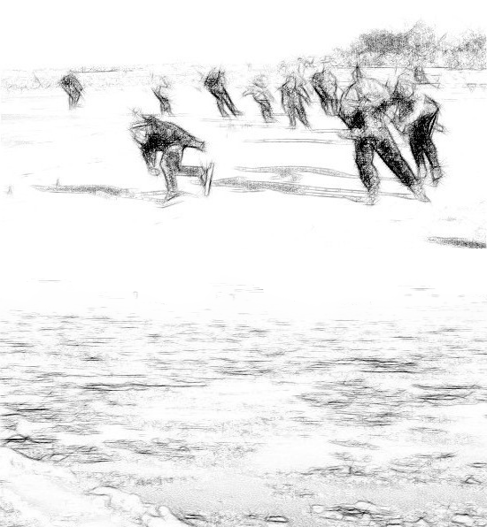

# 西夏王陵生死決，黃河之上險環生

翌日西夏一品堂高手打開冰窖時，章達孚已然全身僵硬。 眾人以為他死了，把他棄於荒野。 章達孚醒來之後，發現自己又重回到人間。 昨夜之事如在夢中，章達孚疑幻疑真，腦海裡想到的只有他的兒子。 於是他回到韓秋生的住處，只見阿燕躺在床上，胸口插著一把匕首。 章達孚本想要找她報仇，此時卻緊緊把她抱著。 阿燕氣若游絲道："大哥，你來得正好..."章達孚道："你...你這是為何？！"

阿燕答道："我再沒有臉見你和我的孩兒。 我死了倒好...你們就不用再為我自相殘殺了..."章達孚泣道："我們一起走，我會有辦法的！" 阿燕道："不...大哥...你快走...你快走..."章達孚低聲道："不！我不走！" 又道："你不用害怕，我陪你一起去便是了。" 說完便拔出插在阿燕身上的匕首，要往自己胸口插去。 阿燕連忙阻止道："大哥...我不值得你為我這樣。" 章達孚泣道："我倆夫妻一場，不能同生，但願同死！" 阿燕道："大哥...其實我愛的人並不是你...何必..."章達孚聽她這樣說，又氣又怒又悲又痛，用力握著她的咽喉，大聲叫道："你騙我！你騙我！" 但見阿燕嘴角帶笑，氣絕而亡。

此時正好韓秋生和兩名西夏一品堂高手回來，見阿燕死在章達孚的懷裡，又驚又怒道："師父你好狠！" 兩西夏一品堂高手見章達孚死而復生，無不詫異，便要來拿他。 章達孚怒極向二人出掌，只聽到二人慘叫之聲，不斷在地上翻滾。 章達孚暗道："原來昨夜並不是做夢！" 韓秋生怕驚動其他人，拿著章達孚的兒子道："師父，夠膽便隨我來！" 說完便直奔出去。 章達孚道："不要傷害我兒！" 也跟了出去。

章達孚直追到西夏王陵，便失去了韓秋生的踪影。 西夏王陵位於賀蘭山東麓，整個陵園仿宋陵建造，宏偉壯觀。 另外西夏人篤信佛教，所以在陵園內多處又築有以佛教為主的巨型石像。 半晌但見韓秋生站立在一巨大石像'妙音鳥'的頭頂。 '妙音鳥'乃佛教中人面鳥身的神，但見'妙音鳥'雙手合十，形態栩栩如生。

章達孚抬頭喊道："我兒在哪裡！？" 韓秋生怒道："我把他活埋了！" 又道："昨夜沒有把你的真氣全吸盡，燕妹，是韓郎一時大意害了你！" 又道："今天要你再嚐嚐北溟神功的厲害！" 說完之後在石像的頭頸用力一踢，妙音鳥的頭頸便立時斷開，頭部在雪地上直向章達孚滾過去。 章達孚咬牙道："今天我跟你拼了！"

章達孚避開滾石，同時出掌擊向韓秋生。 只聽到韓秋生道："來得正好！" 二人同時對掌，章達孚的真氣便源源不絕地流到韓秋生身上，不久便癱軟在雪地上。 韓秋生道："我本來只是要你們乖乖留在少林，師父你為甚麼要回來！？為甚麼要逼我殺你！？"

章達孚道："你為甚麼會變成這樣？竟然為了一個水性楊花的女子，做出這種大逆不道之事！" 韓秋生哭泣道："我不准你這樣說她！你知道些甚麼？在你還未成親之前，我和她已經山盟海誓。" 於是把事情的前因後果一五一十說出來。 章達孚聽後心如刀割。 韓秋生哭道："我們是真心相愛的。 是你！是你拆散了我們！都是你不好！" 韓秋生便想運功出掌擊向章達孚，立時幽冥神掌毒性在他體內發作，倒在地上。

本來以韓秋生如今的功力，章達孚並不是他對手。 偏偏他施展北溟神功，把幽冥神掌的真氣和寒毒一併吸入自己的氣海之內，立時便毒發攻心，在地上不斷的翻滾。 章達孚上前問道："徒兒你怎樣了？" 韓秋生喊道："好痛！好痛！師父你還是殺了我吧！" 章達孚見他飽受寒毒折磨，想起往日的恩情，含淚道："徒兒你先行一步，為師隨後便來。" 便一劍直刺入韓秋生胸口。

章達孚但覺生無可戀，正想自刎之際，突然聽到嬰孩的哭聲，才從沉痛中驚醒醒過來。 果然在另一神像的後面發現了他的兒子。 章達孚想起還有很多事情未做，於是便打消了自殺的念頭。

章達孚連忙潛入皇宮見西夏銀川公主。 銀川公主驚聞噩耗，便把自己的嬰孩託付給他。 並和他歃血為盟，要章達孚誓死保存她兒子的性命。 臨走前又把她的所有財寶給了章達孚。

章達孚匆忙用布將兩個嬰孩繫在一起，便策馬往東逃跑，來到了黃河邊時天已亮，見河水結冰，不知能否騎馬通過，於是便翻身下馬，步行過河。 豈知來到河中心時，便有二十餘西夏武士從四方八面湧出來。 原來他們早已埋伏在這裡等候多時。 章達孚見他們的靴子下都鑲有一塊鐵片，使他們能在冰上迅速滑行。 章達孚把兩個嬰孩徐徐放在腳下，對西夏武士道："章某今日自知九死一生，請各位放過這兩個嬰孩，章某來生再報各位的恩德！" 帶頭的大鬍子武士雖聽不懂他的話，但已會意，便點了一下頭，並跟其他武士說了幾句話，其餘各人均拱手作揖，似是遵命之意。

章達孚拿起佩劍，此時見西夏武士已排出陣勢，圍著自己不斷轉圈，似是訓練有素。 突然他們各自散開，像穿花蝴蝶般向他進攻，不需多時章達孚已身中多刀。 此時再有一武士來進攻，章達孚硬受了一刀之後，便向此人出掌。 此人凌空飛出後，落地之時正好把河面上的冰砸碎，整個人沒入水裡。 其他人見狀，顯得十分著急。 章達孚心想："原來他們和我一樣都不熟水性。" 此時見另一綠衣武士把兩個嬰孩抱了起來，正要扔到河裡。 他見大鬍子似要阻止，但已經遲了一步，兩個嬰孩被扔進水裡。

章達孚見狀，萬念俱灰，大聲道："章某今日要與你等同歸於盡！" 同時雙掌擊向冰上。 這一掌使上了十成功力，章達孚擊出之後便口噴鮮血。 然後他又跳到另一邊，又雙掌擊出，同時不斷地獰笑，聽得各人毛骨聳然。 如是者擊了五掌，每掌擊出後均口噴鮮血。 此時河面上的冰已四分五裂，随水漂流。 眾人站在冰上左搖右擺，只好把自己的靴子脫了下來。 有幾個武士驚恐地踏著冰塊回到岸上，有幾個不慎便掉到水裡去。

此時章達孚見綠衣武士正想逃跑，便飛身擋住了他的去路，大聲道："還想走？" 二人劇鬥了一輪，最後綠衣武士也不慎掉進水裡。 接著大鬍子又和他劇鬥了一輪，最後雙掌擊出，這一擊雷霆萬鈞，章達孚只好接掌。 二人對掌後都各自震開，章達孚腳下的冰塊流到較大的冰塊旁，大鬍子腳下的冰塊卻流到了河的中央，四周只有碎小的冰塊。 大鬍子此刻見兩個嬰孩就在他附近，猶豫了一會便跳到水裡。

章達孚以為他要對他們不利，十分著急。 豈知大鬍子拿到了兩個嬰孩，便馬上把真氣輸給他們，直到聽到他們的哭聲，才用力擲向章達孚。 章達孚喜出望外。 豈料兩個嬰孩到了空中繫著他們的布便鬆開，分別在左右兩邊飛出。 章達孚只能選擇其中一個來救。 就在這電光火石之間，章達孚決定犧牲自己的孩子。

章達孚接過嬰孩之後，也不知大鬍子是生是死便帶著嬰孩逃跑了。 章達孚雖得以逃過大難，但在與大鬍子武士對掌時，已為反震的幽冥神掌寒毒所傷。 章達孚隨著黃河自南往北而行，此時不敢再往東走，索性往北面大漠方向逃去。

章達孚在大漠躲起來療傷。 五年後，又沿著黃河回到中原隱居起來。
