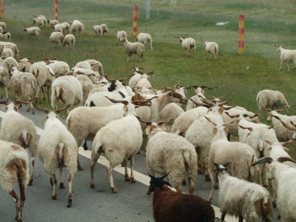

# 古樂仙音猶未盡，幽冥神掌初有成

接著舞台上一老者拉起二胡。 只聽到弦聲哀怨，直達眾人心坎。 章繼春小聲問旁邊的蕙姐道："這黃衫女子是誰？" 蕙姐笑道："她便是我們麗春院的台柱香蘭。" 此時章繼春見香蘭已經翩翩起舞，舞姿有萬種風情，一邊跳舞一邊唱道：

```text
[00:35.59]太匆匆
[00:40.38]人生如夢太匆匆
[00:48.01]看林花
[00:51.67]謝了春紅
[01:00.30]夜來風
[01:04.54]朝來寒雨夜來風
[01:11.88]離愁剪不斷
[01:14.94]啊理還亂
[01:18.45]另一種滋味
[01:21.37]在我心頭中
[01:24.95]啊~ 剩下胭脂淚
[01:34.73]和我相留醉
[01:41.40]自是人生長恨
[01:45.09]無奈水長東
[01:49.50]啊~ 不怕剪不斷
[01:59.37]只怕理還亂
[02:05.85]何時再重逢
```

章繼春認得該女子便是剛才在花園裡偷偷灑淚的女子，此刻卻是風情萬種。 章繼春見她拿著酒壺一屁股坐在對面賓客的腿上，自斟自飲。 這賓客眉開眼笑，正欲一親芳澤之際，卻又被她推開。 接著香蘭繼續一邊跳舞，一邊唱道：

```text
[02:15.64]寂寞中
[02:20.19]我心因何寂寞中
[02:27.86]說不出
[02:31.76]獨上西樓
[02:40.19]月如鉤
[02:44.46]梧桐深院鎖清秋
[02:51.80]離愁剪不斷
[02:55.16]啊理還亂
[02:58.15]另一種滋味
[03:01.11]在我心頭中
[03:04.71]啊~ 剩下胭脂淚
[03:14.50]和我相留醉
[03:21.20]自是人生長恨
[03:24.94]無奈水長東
[03:29.30]啊~ 不怕剪不斷
[03:39.03]只怕理還亂
[03:45.44]無處說離愁
[04:43.45]啊~ 剩下胭脂淚
[04:53.34]和我相留醉
[04:59.98]自是人生長恨
[05:03.73]無奈水長東
[05:07.85]啊~ 不怕剪不斷
[05:17.74]只怕理還亂
[05:24.12]何時再重逢
```

唱完這歌曲，香蘭便回到內堂，留下眾人還在如痴如醉。 此時見一婦人出來笑道："各位官人只要誰能出得起最多的銀兩，今晚便可以和小女香蘭在廂房把酒談心，千萬不要錯過唷！" 章繼春拿著了那麼多的黃金，正發愁無處花費，於是隨手便拿出十兩黃金來道："我願意出十兩黃金！" 嚇得眾賓客目瞪口呆。 章繼春便得意洋洋的大搖大擺地隨著婦人進廂房裡。

此時廂房裡已經預備好了酒菜，香蘭換了一襲輕紗，酥胸半露，前來為章繼春斟酒。 香蘭笑問道："官人是哪裡來的人？" 章繼春答道："好說了，大爺便是丐幫來的！" 香蘭喜道："小女子早已聽聞丐幫的威名，尤其是喬幫主的英雄事蹟，想不到今夜竟得見丐幫中的英雄！" 章繼春得意洋洋，口裡說的盡是些市井之話，香蘭不禁大為失望。

酒過三巡後，章繼春半醉道："香蘭姑娘我來替你贖身，大爺如今不差錢，以後你便不用過著這些對人歡笑背人垂淚的日子了。" 香蘭面有難色道："官人好意小女子心領了，只不過..."章繼春奇道："只不過甚麼了？難道你說大爺配不上你！" 章繼春心中有氣，暗想道："大爺沒錢的時候別人瞧不起也便算了，如今有錢了還是瞧不起我來？"

章繼春問道："這種地方難道你還想找喬幫主這號人物麼？" 這句話擊中了她的心坎，香蘭暗想道："他說的沒錯，長此下去也不是個結局，我便認命吧！" 只是這話怎能說出口？反說道："就是找不到又如何？我一輩子留在這裡也落得逍遙自在。" 這種自我保護的話章繼春當然是聽不懂，便反問道："怎麼個'逍遙自在'法？我來做個實驗好了。 來！坐在我大腿上！" 香蘭先是一怔，然後幽幽的道："還以為官人是真心為香蘭好！原來是來作賤人！" 章繼春氣道："我怎麼作賤你了？剛才你不是一屁股的坐在那些賓客的大腿上麼？怎麼他們可以，我便不可以了？！你是瞧不起我麼？" 此時香蘭也氣了，道："我以為丐幫個個都是幹大事的英雄好漢，原來就只知道欺負我們這些弱女子！" 此時外面的人聽到二人在吵架，都進來勸阻。 章繼春怒道："好！此刻我便幹幾件大事去，回來看你還有何話說！" 說完便跳出窗外去了。

章繼春所謂的'幹幾件大事'，便是為父報仇。 於是找一個無人的地方，先把"草上飛"的武功煉起來。 章繼春看到這秘笈上註明'凡練此功者必須先廢去自身的內功，否則便會走火入魔。 '、'這輕功每運功一次，體內的北溟真氣便會增加一分'。 章繼春想道："反正我師父從來便沒有教過我內功，練練倒是無妨。" 章繼春按著秘笈上的方法運功，便覺身輕如燕。 他用'草上飛'輕功每天一直往西奔走，幾天之間內力已相當於別人二十年的功力！因此對這兩部秘笈便增加了不少信心。

只是到了後來再練下去也沒有多大進境，於是便改練'幽冥神掌'。 只是一練下來，便有點不對勁。 章繼春一邊按秘笈上的口訣運功，一邊彷彿便聽到上官無極嘲笑之聲："看你這副德性！我是你的話便撞牆死了算。" 章繼春最為痛恨的便是上官無極，心想："等我神功練成之後，第一個要殺的便是你！" 接著又繼續練功。

過了一會，章繼春彷彿又聽到拋棄他的翠蓮笑道："誰會嫁你這死窮鬼？" 接著又聽到'麗春院'的香蘭笑道："我便是一輩子找不到男人，也不會嫁給你！" 又過了一會，章繼春更是彷彿聽到無數葫蘆鎮上的人的嘲笑之聲，而且全身像火燒似的，只有揮拳出掌，才能解除痛楚。 章繼春口中喃喃的道："別笑！別笑！你等都別笑！" ，出掌更是排山倒海的，像擊向譏笑他的人。 只是過了不久這像火燒似的痛楚又加倍而回。

此時章繼春想起昨天在山上看到一些像梯田狀的池水，於是強忍著痛楚，回到昨天的水池。 章繼春一跳入池裡，便覺不妥，寒氣不斷進入體內，但此時已無法上岸，只能不斷用掌力將寒氣逼出，只是不久便支持不住昏過去了。

章繼春醒來的時候，已然在岸上，旁邊一小孩嚇了一跳，道："還以為你死了！" 章繼春問道："是你救我上來的麼？" 這小孩答道："嗯，是我拖你到岸上來。" 又道："這水真冷。" 章繼春問小孩為何到此深山之中，小孩答道："這山名叫'黃龍山'，山上有一道觀名叫'黃龍觀'。 這次隨父親前來拜訪。 想不到裡面的道士都是欺世盜名的，還不如獨個兒出來吸收這山上的靈氣！" 章繼春又問這小孩名字，小孩不敢透露真實姓名，因平常和別的小孩玩耍的時候，常自號'重陽真人'，於是便答章繼春道："我叫王重陽。"

章繼春決意要為父報仇。 此時見已離青城山不遠了，所以便決定先向司馬臨下手，於是轉向南行。 章繼春翻山越嶺，一日，來到一高山上，此處空氣十分稀薄，樹木已不能生長。 章繼春前行見不遠處有一群羊竟在這裡吃草。 這羊比一般所見的稍有不同，有一條短小的尾巴。 章繼春正想殺一頭羊來吃，便想走向羊群。 此时，遠遠看見羊群突然驚慌逃跑起來，原來一頭猛獸也從另一方向正向羊群走去。 這頭猛獸樣子像一頭狗，卻比狗大一倍之多。 章繼春見它緊追在羊群後面，突然奮力撲向一頭羊，一口咬著羊的屁股不放。 這頭羊此時還在向前奔跑，可憐內臟連著屁股便活生生被一起撕了出來。 章繼春嚇了一跳，心想："這畜生也太可惡了，等我拿它來試試新練成的掌法！" 章繼春走近這頭猛獸，同時有兩頭幼獸出現，在吃地上的內臟。 原來這頭猛獸是它們的母親。 這母獸只在旁邊看著，不時伸出舌頭舔它們。 章繼春見狀，又不忍殺它。 此時母獸見章繼春走近，以為他要對兩幼獸不利，發出咆哮的叫聲。 章繼春正欲走開時，母獸已撲向他。 章繼春驚恐起來，便連擊數掌。 母獸終於倒在地上，奄奄一息，此時兩幼獸走到母獸的身旁，不斷發出哀號。


