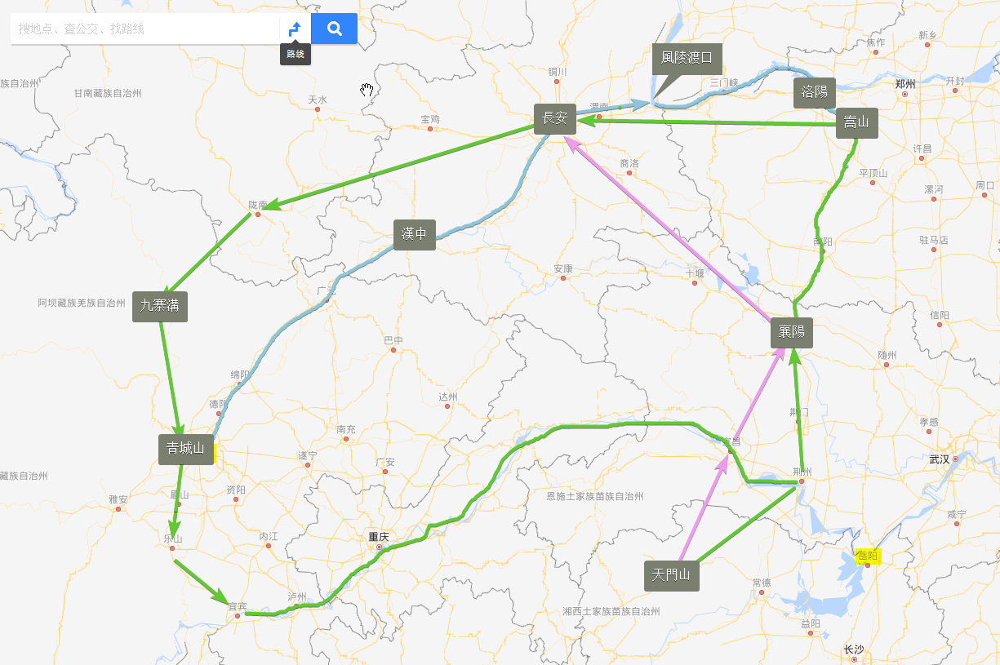

# 好夢由來容易醒，前塵已往不堪提

章繼春見傷勢已無大礙，便雇了一輛馬車往北行。 不日便到了少林附近。 沒多久便查到了玄空大師已經不在少林寺居住，而是隱居在後山的一個茅廬裡。 章繼春對報仇本已不抱太大的希望，但見這後山四處無人，便姑且一試。 此時他見後山中有一山洞，正沉思是否可以作躲藏之用，忽聽到後面傳來一把聲音："這山洞十分危險，進不得。" 回頭一看，見一龍鍾僧人正對著他微笑，原來正是玄空。 章繼春便依樣葫蘆假意說來拜他為師。

章繼春隨著玄空到了茅廬，見一小和尚在門前掃地，章繼春心想："看這茅廬那麼小，這次應該不會叫我留宿罷，就是打死也不留！" 小和尚喜道："太師父。" 章繼春見玄空看著秘笈，眼睛已不好使，勉強才能看到秘笈上的字。 章繼春心裡罵道："他媽的你就是再好武功，過三五七年還不是一樣要歸西？我何苦要冒這個險！" 玄空大師道： "請坐。" 跟著向小和尚道："妙法，去泡些茶來。" 小和尚笑道："太師父，我是妙道呀，妙法師兄已經還俗去當捕頭去了。 我是來替他的。" 跟著向章繼春笑道："太師父最近記性越來越差，近期發生的事有時一點也記不起，但舊時的事有時卻記得清清楚楚。" 章繼春好奇問道："剛才你說的番僧是甚麼意思？"

妙道答道："這番僧遠道從吐蕃而來，來了少林寺已經好幾個月了。 說得一口流利漢話，不但精通佛法，對道學也頗有心得。 我們出家人都戒喝酒的，他偏說這酒可以延年益壽！你說好笑不好笑。" 接著便去泡茶了。

章繼春見玄空還在看秘笈，便不打擾。 過了一會，玄空把秘笈合上，對章繼春道："小施主我看這秘笈上的武功還是不練為妙。" ，又道："此掌法陰狠毒辣，而且，施掌者若以此和人對掌，若是對方內力勝過了他，掌力回激入體，自身反受大禍！" 便把秘笈交還給章繼春。 章繼春心想："看這和尚一點也不像老頭子所說的十惡不赦的惡人，當中定是有我不為所知的原委。 也罷，那我便溜之大吉了。"

玄空道："小施主若想學少林派的武功，老衲這裡有兩本入門的羅漢拳和少林長拳的拳譜。" 一邊說一邊從書架上拿了兩本拳譜給章繼春。 章繼春以前也見過別人練這兩套拳，不過是些強身健體的武功。 便問玄空："大師可有些更厲害的武功？" 章繼春此時已經打消了報仇的念頭，心情便輕鬆起來。 玄空笑道："練武切忌好高騖遠，先要把根基打好，只要根基打好了，就是羅漢拳也是厲害無比的，不信我試給你看看。" 說完便帶章繼春到茅廬外，把羅漢拳和少林長拳一一演練起來，真的威力無窮，看得章繼春目瞪口呆。 此時見妙道泡了茶回來，對章繼春笑道："太師父今天好興致！" 然後一起回到茅廬裡用茶。

玄空問章繼春如何到來，章繼春於是便將旅途上的所見所聞摘要地說了一遍，有些像五彩池、碧水寒潭、小尾羊等，連玄空也從未見過，是以聽得津津有味。 章繼春將當日在深山中殺死母獸的事告訴玄空，又問他道："大師，佛家常常叫人不要殺生，但是如果換了是大師，難道也白白讓它咬死麼？" 玄空於是把佛祖割肉餵鷹的故事說了一遍，又從書架上拿了一些佛經給章繼春，叫他回去看看。 章繼春又把他小時候如何和師弟戲弄師父的事告訴玄空，說得眾人呵呵大笑。 章繼春又道："我從小便被人瞧不起，哪天能學得大師一半的武功，便沒有人敢小看我了。" 玄空笑道："別人瞧不起不要緊，千萬不要自己瞧不起自己。" 章繼春想起了自己的胡作非為，無非是要別人不敢小看他，"其實心底裡何嘗不是自己也瞧不起自己？" 玄空見章繼春默然不語，又問章繼春如何讀書識字。 章繼春答道："小時候經常在大街上碰到一老伯，是他教我讀書識字的，又常說故事給我聽。" 章繼春想起當時和他一起讀書寫字的，還有秋月，這是他一生中最快樂的時光。 章繼春黯然道："只是後來這老伯便再沒出現了。"

二人一老一少，卻十分投緣，不知不覺便日暮西沉了...

章繼春心想："何不將錯就錯，在附近找一個房子安頓下來，然後找份差事，或是做點小賣買，從新做人，以前的事便當是發了一場夢算了。" 想到永遠便不回去，章繼春不期然便想起了秋月。

章繼春見天色已晚，便伸了一個懶腰，起身告辭。 此時玄空走近他的身邊，看到他的容貌，突然想起甚麼似的，說道："不可能！不可能！你真的像他！" 章繼春害怕起來，道："我...像...誰？" 玄空雙手緊緊握著他的肩膀，仔細辨認章繼春的容貌，道："你像一個我很久沒見面的故人。" 章繼春道："不是！不是！" 玄空道："是的，你是！你是！" 章繼春腦內一片空白，雙掌打向玄空，然後便想逃跑。 妙道擋在門前哭道："你別走！你為何打我太師父？" 玄空被一掌擊中飛出撞向牆上，登時頭破血流，躺在地上，並說道："別打！"

原來玄空怕內力反震寒毒便會回激入章繼春體內，於是便不用內力抵抗硬受了一掌。 玄空喊道："你不是他對手。 老衲只要運功調息一下便好了。" 豈料玄空一運功，體內寒毒便不受控制四處亂走，登時吐了一口血。 妙道驚道："快救我太師父！" 章繼春哪裡知道如何去救。 心慌意亂之際，又是一掌把妙道打倒，然後奪門而出。

章繼春路過一飯店吃飯，見旁邊坐著一老者和一小胖子，正在討論司馬臨和卓亦凡之死。 小胖子道："江湖上人人正在談論這事。" 老者道："江湖仇殺比比皆是，值得大驚小怪麼？" 小胖子道："原來你還不知道，他們身上都有一奇怪的碧綠掌印，這掌中之毒無藥可解，青城派掌門姜華救了三日三夜，結果還是一個也沒救回來。" 章繼春聽到也嚇了一驚，心裡疑惑："都死了？" 老者道："查到是誰做的？" 小胖子搖了搖頭，道："當晚有人看到一個身穿摩尼教服飾的人匆匆忙忙的走過，我看一定是摩尼教所為。" 老者道："摩尼教自唐代開始便從西域傳入中土，一向行事低調，我看可能是有人想嫁禍摩尼教也不一定。" 此時有一大漢走過來道："諸位也在說起此事，可知道少林的玄空大師也遭毒手了？" 老者和胖子齊聲道："此事當真？" 大漢道："我從少林那邊過來的，哪裡還會假？" 章繼春暗道："玄空大師也死了？" 眾人皆疑惑兇手到底是何方神聖。 大漢又道："不過我看此事很快便會水落石出。" 老者道："何以見得？" 大漢道："玄空大師是天下第一神捕路瀛海的恩師，路捕頭豈會坐視不理？聽說他一聽到消息，連快臨盆的妻子也不理便趕赴少林！" 章繼春暗道："想不到我害死了那麼多人！"

